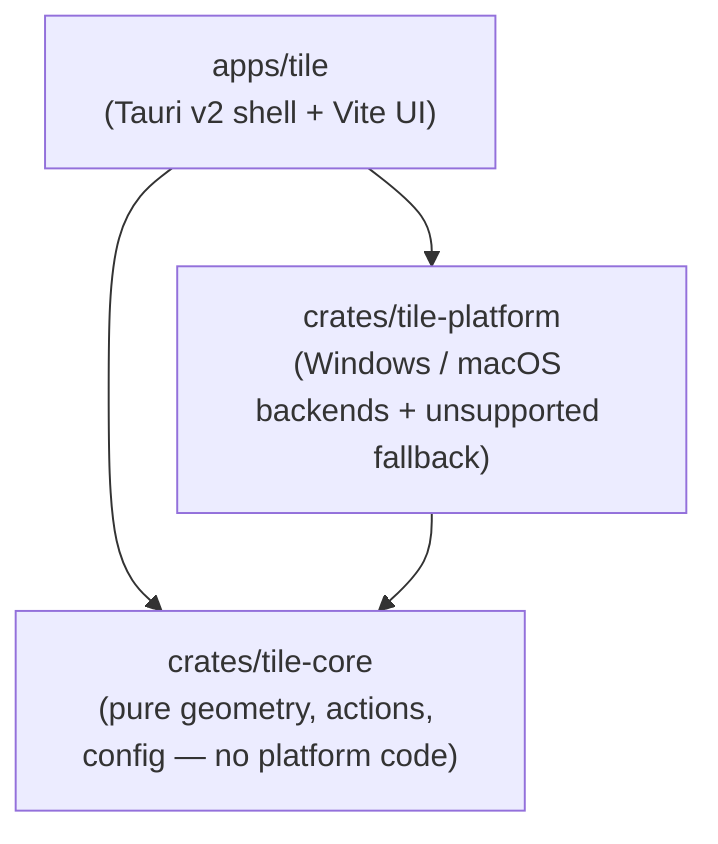

# Tile

**Keyboard-driven window management for Windows and macOS.**

Tile is a cross-platform reimagining of the excellent
[Rectangle](https://github.com/rxhanson/Rectangle) — the macOS window-snapping
app — built from scratch in Rust so the same window-tiling ergonomics work on
both macOS **and** Windows. Snap the focused window to halves of the screen,
maximize it, center it, or undo the last move, all from the keyboard.

> **Status: early MVP.** Tile currently implements a focused set of actions:
> **left half, right half, top half, bottom half, maximize, center, and
> restore**. That is the whole scope today — it is deliberately small. More
> actions (quarters, thirds, multi-monitor throws, and a settings UI) are
> planned, but this README only documents what actually works right now.

## Default keyboard shortcuts

Only the halves differ between platforms. Everything else shares the same
letters, so one set of habits works on both.

Those letters come from Rectangle's alternate defaults, and they are
*spatially* mnemonic rather than arbitrary:

- `D` `F` `G` are adjacent home-row keys running left to right — first,
  center and last third.
- `E` sits above the `D`/`F` boundary (the first two thirds), `T` above
  `F`/`G` (the last two thirds).
- `U` `I` `J` `K` form a 2×2 block on the keyboard that maps onto the four
  screen corners.

Every shortcut is rebindable, and the wider catalogue (fourths, sixths,
ninths, corner thirds) ships unbound — reachable from the tray menu, or bind
your own.

| Action            | macOS                            | Windows                       |
| ----------------- | -------------------------------- | ----------------------------- |
| Left half         | `Ctrl` + `Option` + `←`          | `Win` + `←`                   |
| Right half        | `Ctrl` + `Option` + `→`          | `Win` + `→`                   |
| Top half          | `Ctrl` + `Option` + `↑`          | `Win` + `Alt` + `↑`           |
| Bottom half       | `Ctrl` + `Option` + `↓`          | `Win` + `Alt` + `↓`           |
| Maximize          | `Ctrl` + `Option` + `Return`     | `Win` + `↑`                   |
| Restore           | `Ctrl` + `Option` + `Backspace`  | `Win` + `↓`                   |
| Maximize height   | `Ctrl` + `Option` + `Shift` + `↑`| `Win` + `Alt` + `Shift` + `↑` |
| Center            | `Ctrl` + `Option` + `C`          | `Win` + `Alt` + `C`           |
| First third       | `Ctrl` + `Option` + `D`          | `Win` + `Alt` + `D`           |
| First two thirds  | `Ctrl` + `Option` + `E`          | `Win` + `Alt` + `E`           |
| Center third      | `Ctrl` + `Option` + `F`          | `Win` + `Alt` + `F`           |
| Center two thirds | `Ctrl` + `Option` + `R`          | `Win` + `Alt` + `R`           |
| Last two thirds   | `Ctrl` + `Option` + `T`          | `Win` + `Alt` + `T`           |
| Last third        | `Ctrl` + `Option` + `G`          | `Win` + `Alt` + `G`           |
| Top left          | `Ctrl` + `Option` + `U`          | `Win` + `Alt` + `U`           |
| Top right         | `Ctrl` + `Option` + `I`          | `Win` + `Alt` + `I`           |
| Bottom left       | `Ctrl` + `Option` + `J`          | `Win` + `Alt` + `J`           |
| Bottom right      | `Ctrl` + `Option` + `K`          | `Win` + `Alt` + `K`           |

### Why Windows uses `Win`+`Alt` and not `Ctrl`+`Alt`

Mirroring macOS exactly would mean `Ctrl`+`Alt`+letter — but **Windows treats
`Ctrl`+`Alt` as `AltGr`**. On many international layouts `AltGr`+key is how you
type `@ € { } [ ] \ ~`. Because Tile's keyboard hook swallows the keystrokes it
matches, `Ctrl`+`Alt` defaults would make those characters impossible to type;
on a German layout you could no longer type `@`. `Win`+`Alt` avoids this
entirely.

A few defaults do take combinations Windows itself uses — `Win`+`Alt`+`D`
toggles the desktop clock, for instance. Tile wins those because it hooks the
keyboard at a lower level, which is the same mechanism that lets it claim
`Win`+Arrow back from Aero Snap. See
[#18](https://github.com/filipmares/tile/issues/18) for the planned setting to
hand individual combinations back to the OS.

### Known conflict: Xbox Game Bar

Two defaults collide with Xbox Game Bar, and **Tile cannot win these**:

| Shortcut | Tile | Game Bar |
| -------- | ---- | -------- |
| `Win` + `Alt` + `G` | Last third | Record last 30 seconds |
| `Win` + `Alt` + `R` | Center two thirds | Start/stop recording |

Both will fire: the window tiles *and* Game Bar starts recording.

This is not something Tile can fix. Game Bar's capture shortcuts are handled by
the GameDVR component through an input path that never reaches the user-mode
keyboard hook, so there is nothing to suppress. Shell shortcuts such as Aero
Snap *are* interceptable, and Tile blocks those successfully — GameDVR is the
exception. (`Win`+`Alt`+`M`, `Win`+`Alt`+`B` and `Win`+`Alt`+`PrtScn` are
reserved the same way; Tile does not bind them.)

These letters were kept anyway, deliberately. They are Rectangle's, and they
are spatially mnemonic rather than arbitrary, so anyone running Rectangle on a
Mac and Tile on Windows keeps one set of habits. The conflict is fixable by the
user in about twenty seconds; a broken mnemonic would not be.

**To fix it**, clear Game Bar's shortcuts:

1. Press `Win` + `G` to open Game Bar
2. Go to **Settings ▸ Inputs ▸ Keyboard** (the gear icon)
3. Clear or replace **Record last 30 seconds** and **Start/stop recording**
4. Click **Save**

Alternatively, disable Game Bar captures entirely in **Settings ▸ Gaming ▸
Captures**, or rebind Tile's *Last third* and *Center two thirds* to keys of
your choosing — every Tile shortcut is rebindable.

Tile will not change Game Bar's settings for you. An application silently
reconfiguring another application's shortcuts is not behaviour you should have
to trust.

<sub>These tables are generated from `crates/tile-core/src/config.rs`
(`default_bindings`) — the single source of truth for Tile's defaults.</sub>

## Platform notes

### Windows: Tile takes over `Win`+Arrow from Aero Snap

On Windows, Tile installs a **low-level keyboard hook** (`WH_KEYBOARD_LL`) so it
can claim `Win`+Arrow combinations that the shell otherwise routes to the
built-in **Aero Snap**. This means:

- While Tile is running, `Win`+`←`/`→`/`↑`/`↓` drive Tile instead of Aero Snap.
- The hook **cannot see input directed at windows owned by elevated
  (administrator) processes** unless Tile itself is running as administrator. If
  a shortcut seems to do nothing over an elevated app, that's why.
- Some corporate security / anti-cheat software is suspicious of global
  keyboard hooks and may flag or block them.

If you'd rather keep Aero Snap, **rebind** Tile's shortcuts to combinations that
don't collide with the shell.

### macOS: Accessibility permission

macOS requires you to grant Tile the **Accessibility** permission before it can
move other applications' windows. Grant it under:

**System Settings ▸ Privacy & Security ▸ Accessibility** → enable **Tile**.

You may need to toggle it off and on again after updating the app.

Because the released builds are **unsigned and unnotarized** (see below),
Gatekeeper will block the first launch. Remove the quarantine attribute:

```sh
xattr -d com.apple.quarantine /Applications/Tile.app
```

…or right-click the app in Finder and choose **Open** the first time.

## Installation

### From Releases

Grab the latest build from the [Releases](https://github.com/filipmares/tile/releases)
page:

- **Windows:** the `.msi` or the NSIS setup `.exe`.
- **macOS:** the universal `.dmg` (runs on both Apple Silicon and Intel).

> Release binaries are currently **unsigned**. Windows SmartScreen may warn you
> (**More info ▸ Run anyway**), and macOS needs the Gatekeeper workaround above.

### From source

See [Build from source](#build-from-source).

## Build from source

### Prerequisites

- **Rust** (stable) — install with [rustup](https://rustup.rs/).
- **Node.js 18+** and npm — for the frontend under `apps/tile/ui`.
- **Windows:** Visual Studio **C++ Build Tools** + **Windows SDK** (provides
  `link.exe`) and the **WebView2** runtime (preinstalled on Windows 11).
- **macOS:** **Xcode Command Line Tools** (`xcode-select --install`).

### Build

```sh
# 1. Frontend dependencies
cd apps/tile/ui && npm ci && cd ../../..

# 2. Build and test the workspace
cargo build --workspace --release
cargo test --workspace
```

### Run the app

```sh
cd apps/tile

# Development: hot-reloading settings UI
./ui/node_modules/.bin/tauri dev

# Release installers (.msi + .exe on Windows, .dmg on macOS)
./ui/node_modules/.bin/tauri build
```

Installers are written to `target/release/bundle/`. The app has no main
window — look for the icon in the system tray (Windows) or menu bar (macOS),
and choose **Settings…** from its menu.

## Testing

Most of Tile is verifiable without a desktop. `cargo test --workspace` covers
the tiling geometry, the restore history, hotkey parsing, the Windows
`KeyCode`→virtual-key tables and DWM frame arithmetic, and the macOS
coordinate flip — the last of these runs on every platform, not just macOS.

The macOS backend can also be type-checked from Windows or Linux, which is
how it is validated on every pull request:

```sh
rustup target add aarch64-apple-darwin
cargo clippy -p tile-platform --target aarch64-apple-darwin --all-targets -- -D warnings
```

Two things genuinely need a live desktop session, so they ship as examples
rather than tests:

```sh
# Moves a real window through every action and asserts it lands pixel-exact.
# Pass a window handle to target a specific window instead of the focused one.
cargo run --example live_smoke -p tile-platform

# Installs the real keyboard hook, injects Ctrl+Alt+Shift+M, and checks the
# bound action is delivered, repeats, and stops firing once unbound.
cargo run --example live_hotkey -p tile-platform
```

To test the shortcuts end to end, build and start the app, open a window you
do not mind moving, and press <kbd>Win</kbd>+<kbd>←</kbd>. Note that the
keyboard hook cannot see input aimed at windows owned by elevated processes
unless Tile is itself running as administrator.

## Architecture

Tile is split into three crates with a strict dependency direction, so the
interesting logic stays testable and every OS API lives behind a trait:



- **`tile-core`** is pure and platform-independent — geometry math, the window
  actions, hotkey definitions, config load/save, and the decision `Engine`. It
  does no I/O beyond JSON and is **heavily unit-tested**, so all of Tile's
  behaviour can be verified on any host (including Linux CI).
- **`tile-platform`** isolates every OS API behind two traits (window
  manipulation and global hotkeys), with a Windows backend, a macOS backend,
  and an `unsupported` fallback so the crate still compiles on other platforms.
- **`apps/tile`** is a thin [Tauri v2](https://v2.tauri.app/) desktop shell with
  a vanilla TypeScript + Vite frontend — it wires `tile-core`'s engine to
  `tile-platform`'s backends and shows the tray/menu-bar UI.

## Continuous integration

Because the primary development machine is Windows-only, **GitHub Actions is the
only place the macOS build is ever compiled** — so CI is intentionally thorough
and fails loudly. Every push and pull request runs `cargo fmt`, `cargo clippy
--workspace --all-targets -- -D warnings`, and `cargo test` on Windows and
macOS, plus a Linux job for the platform-independent crates. See
[`.github/workflows/ci.yml`](.github/workflows/ci.yml).

## Contributing

Contributions are welcome! Please read [CONTRIBUTING.md](CONTRIBUTING.md) for
the project layout, prerequisites, and the checks CI expects.

## Acknowledgements

Tile is **inspired by** [Rectangle](https://github.com/rxhanson/Rectangle) by
Ryan Hanson (MIT-licensed, © Ryan Hanson), and adopts its macOS default
shortcuts so existing users feel at home. Tile is an **independent Rust
implementation** — no Rectangle source code is used or copied. This
acknowledgement is offered as attribution and courtesy, not as a licence
obligation, and does **not** imply that the Rectangle project endorses Tile.

## License

Tile is released under the [MIT License](LICENSE), © 2026 Filip Mares.
