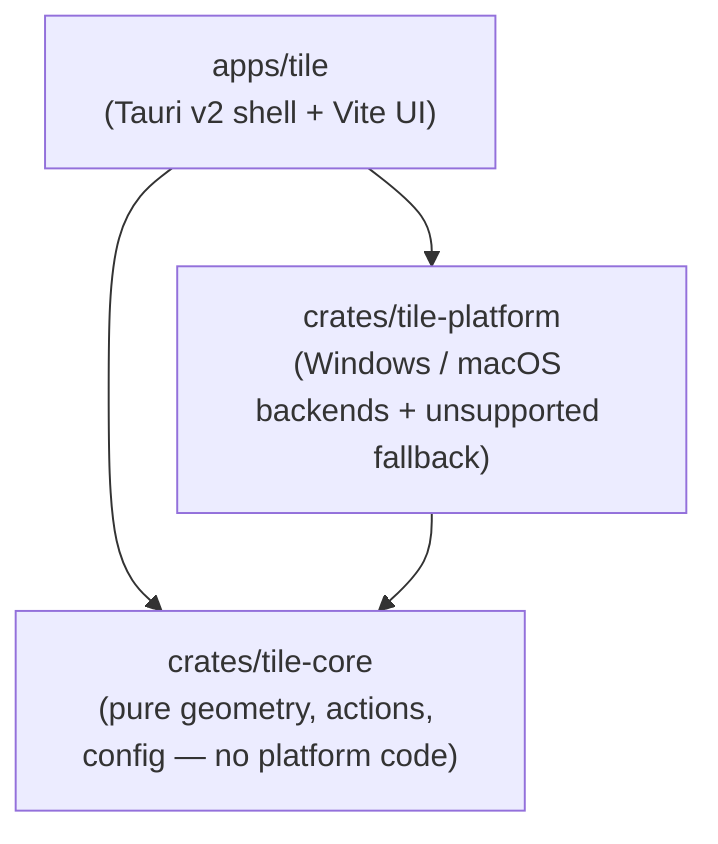

# Tile

**Keyboard-driven window management for Windows and macOS.**

Tile is a cross-platform reimagining of the excellent
[Rectangle](https://github.com/rxhanson/Rectangle) — the macOS window-snapping
app — built from scratch in Rust so the same window-tiling ergonomics work on
both macOS **and** Windows. Snap the focused window to halves and thirds of the
screen, maximize it, or undo the last move — all from the arrow keys.

> **Status: early days.** Tile implements 52 window actions — halves, thirds,
> two-thirds, fourths, corner thirds, sixths, ninths, corners, maximize,
> maximize-height, almost-maximize, center and restore — but only four ship
> bound to keys, with a settings UI and a tray/menu-bar icon for the rest.
> Multi-monitor throws, per-app rules and drag-snapping are not built yet. This
> README documents only what actually works today.

## Default keyboard shortcuts

Every shortcut is the same on both platforms. Only the modifier you hold
differs:

- **macOS** — `Control` + `Option`
- **Windows** — `Win` + `Alt`

Hold that, then press:

| Key | Action |
| --- | ------ |
| `←` `→` | **Left / right** — half, then two thirds, then a third (see below) |
| `↑` | Maximize |
| `↓` | Restore to the window's previous position |

That is the whole default set — **four arrows and nothing else.** No letters, no
`Return`, no `Backspace`, and never a second modifier. The arrows sit under your
right hand while the modifier is held with your left, which matters on a MacBook
because there is no right `Control` key.

The horizontal pair places the window and carries every size, because repeating
an arrow cycles its width:

```text
  ←   ½ → ⅔ → ⅓ → …   anchored left
  →   ½ → ⅔ → ⅓ → …   anchored right
```

The vertical pair is the "bigger / undo" axis: `↑` maximizes, `↓` puts the
window back where it was.

Everything is rebindable, and the rest of the catalogue — the centered column,
the explicitly-sized thirds and two-thirds, the corners, center, maximize-height,
almost-maximize, plus fourths, sixths, ninths, corner thirds and the top/bottom
halves — ships unbound, reachable from the tray menu or a binding of your own.

### Press it again to change the size

Pressing the same shortcut twice does not do nothing. The horizontal arrows and
the four corners **cycle through sizes**: `←` puts the window in the left half,
again makes it two thirds wide, again a third, and again back to a half. Corners
cycle their width the same way, keeping their half height.

The sizes are configurable in Settings ▸ Behaviour — ½, ⅔, ¾, ¼ and ⅓, of
which a half, two thirds and a third are on by default, matching Rectangle. Turn
on ¼ for a four-step cycle. The same section switches the behaviour off entirely
if you would rather a repeat did nothing — though with the sizes unbound by
default, that leaves the arrows at halves only.

The cycle restarts whenever you run a different action, switch to another
window, or move the window yourself, and `↓` always restores the window
to where it was **before** Tile first touched it, however long you cycled for.

### Windows: why not `Win`+Arrow?

Because leaving it alone means **Aero Snap keeps working**. Users who want the
native snapping still have it, and Tile's richer actions live entirely in their
own namespace.

Worth knowing: no two-modifier arrow combination is unclaimed on Windows.
`Win`+Arrow is Aero Snap, `Win`+`Alt`+Arrow is Windows 11's snap variants,
`Win`+`Shift`+Arrow moves between monitors, and `Win`+`Ctrl`+`←`/`→` switches
virtual desktop. Tile preempts *something* whichever it picks. `Win`+`Alt` is
the least-used of them, and Tile's keyboard hook takes it cleanly because the
owner registers through `RegisterHotKey`, which the hook runs ahead of.

### Windows: why not `Ctrl`+`Alt` to match macOS exactly?

Because **Windows treats `Ctrl`+`Alt` as `AltGr`**. On many international
layouts `AltGr`+key is how you type `@ € { } [ ] \ ~`, and Tile's hook swallows
the keystrokes it matches — so `Ctrl`+`Alt` defaults would make those characters
impossible to type. On a German layout you could no longer type `@`.

### Keys Xbox Game Bar reserves

Game Bar owns eight shortcuts, and **Tile cannot win any of them.**
`Win`+`Alt`+`G` is the clearest case: Game Bar's own hotkey is `Win`+`G` and its
handler matches *loosely*, ignoring the extra `Alt`, so the overlay appears even
with Tile shut down. The rest are handled by GameDVR through an input path that
never reaches the keyboard hook.

Users cannot disable them either — Game Bar's settings panel only *adds*
shortcuts, leaving the built-in ones active.

The authoritative list is the `VK*` values under
`HKCU\SOFTWARE\Microsoft\Windows\CurrentVersion\GameDVR`:

| Game Bar action | Shortcut |
| --------------- | -------- |
| Open Game Bar | `Win` + `G` |
| Record last 30 seconds | `Win` + `Alt` + `G` |
| Start/stop recording | `Win` + `Alt` + `R` |
| Microphone on/off | `Win` + `Alt` + `M` |
| Start/stop broadcast | `Win` + `Alt` + `B` |
| Camera on/off in broadcast | `Win` + `Alt` + `W` |
| Show/hide recording timer | `Win` + `Alt` + `T` |
| Take a screenshot | `Win` + `Alt` + `PrtScn` |

So `G`, `R`, `M`, `B`, `W` and `T` are unusable as defaults, and a test enforces
that the defaults stay clear of all six. This used to shape the whole layout —
it is why the letter block sat at `Q`/`A`, and why **center two thirds shipped
unbound**, since the key directly above `S` is `W`. The arrow-only defaults
retire the problem completely: no default sits on a letter, so none of the
reserved keys can collide.

### Why not Rectangle's letters

Rectangle puts the thirds on `D`/`F`/`G` with `E`/`R`/`T` above, and Tile
shipped that briefly. Four of those six keys are reserved by Game Bar, so it
moved one column left to `Q`/`A` — the mnemonic is positional rather than
alphabetic, so sliding it kept the geometry.

That block is now retired altogether. Holding `Control`+`Option` on a MacBook is
a left-hand job, because there is no right `Control` key, so left-hand letters
meant one hand doing both. Cycling the arrows reaches the same sizes with the
hands split, and the explicitly-sized actions remain in the catalogue for anyone
who prefers one press per size. Tile is its own app rather than a Rectangle
port, and one consistent set of shortcuts across your machines is worth more
than compatibility with a different app on one of them.

<sub>This table is generated from `crates/tile-core/src/config.rs`
(`default_bindings`) — the single source of truth for Tile's defaults.</sub>

## Platform notes

### Windows: the keyboard hook

On Windows, Tile installs a **low-level keyboard hook** (`WH_KEYBOARD_LL`)
rather than registering its shortcuts with the OS. That is what lets it claim
combinations the shell already owns — `Win`+`Alt`+Arrow belongs to Windows 11's
snap variants, for instance. This means:

- Tile's shortcuts take precedence over the OS's for the combinations it binds.
  `Win`+Arrow is deliberately left alone, so **Aero Snap keeps working**.
- The hook **cannot see input directed at windows owned by elevated
  (administrator) processes** unless Tile itself is running as administrator. If
  a shortcut seems to do nothing over an elevated app, that's why.
- Xbox Game Bar is the one exception it cannot beat — see
  [Keys Xbox Game Bar reserves](#keys-xbox-game-bar-reserves) above.
- Some corporate security software is suspicious of global keyboard hooks and
  may flag or block them.

Replacing the hook with `RegisterHotKey` wherever the OS will grant the
combination is tracked in
[#19](https://github.com/filipmares/tile/issues/19).

### macOS: Accessibility permission

macOS requires you to grant Tile the **Accessibility** permission before it can
move other applications' windows. Grant it under:

**System Settings ▸ Privacy & Security ▸ Accessibility** → enable **Tile**.

You may need to toggle it off and on again after updating the app.

Builds you compile yourself are unsigned, so Gatekeeper blocks their first
launch. Remove the quarantine attribute:

```sh
xattr -dr com.apple.quarantine /Applications/Tile.app
```

…or right-click the app in Finder and choose **Open** the first time. Builds
published on the [Releases](https://github.com/filipmares/tile/releases) page are
signed and notarized and need neither — each release's notes say so explicitly,
and tell you what to do if a particular build was not signed.

## Installation

### From Releases

Grab the latest build from the [Releases](https://github.com/filipmares/tile/releases)
page:

- **macOS:** the universal `.dmg` (runs on both Apple Silicon and Intel). Open
  it and drag **Tile** into Applications. Signed and notarized builds open
  without a Gatekeeper workaround; follow the release notes if a build is
  marked unsigned.
- **Windows:** the `.msi` or the NSIS setup `.exe`. These are **unsigned**, so
  SmartScreen may warn you — choose **More info ▸ Run anyway**.

Tile has no main window: after launching, look for its icon in the menu bar
(macOS) or the system tray (Windows).

### From source

See [Build from source](#build-from-source).

## Build from source

### Prerequisites

- **Rust** (stable) — install with [rustup](https://rustup.rs/).
- **Node.js 18+** and npm — for the frontend under `apps/tile/ui`.
- **Windows:** Visual Studio **C++ Build Tools** + **Windows SDK** (provides
  `link.exe`) and the **WebView2** runtime (preinstalled on Windows 11).
- **macOS:** **Xcode Command Line Tools** (`xcode-select --install`).

### Build

```sh
# 1. Frontend dependencies
cd apps/tile/ui && npm ci && cd ../../..

# 2. Build and test the workspace
cargo build --workspace --release
cargo test --workspace
```

### Run the app

```sh
cd apps/tile

# Development: hot-reloading settings UI
./ui/node_modules/.bin/tauri dev

# Release installers (.msi + .exe on Windows, .dmg on macOS)
./ui/node_modules/.bin/tauri build
```

Installers are written to `target/release/bundle/`. The app has no main
window — look for the icon in the system tray (Windows) or menu bar (macOS),
and choose **Settings…** from its menu.

## Testing

Most of Tile is verifiable without a desktop. `cargo test --workspace` covers
the tiling geometry, the restore history, hotkey parsing, the Windows
`KeyCode`→virtual-key tables and DWM frame arithmetic, and the macOS
coordinate flip — the last of these runs on every platform, not just macOS.

The macOS backend can also be type-checked from Windows or Linux, which is
how it is validated on every pull request:

```sh
rustup target add aarch64-apple-darwin
cargo clippy -p tile-platform --target aarch64-apple-darwin --all-targets -- -D warnings
```

Two things genuinely need a live desktop session, so they ship as examples
rather than tests:

```sh
# Moves a real window through every action and asserts it lands pixel-exact.
# Pass a window handle to target a specific window instead of the focused one.
cargo run --example live_smoke -p tile-platform

# Installs the real keyboard hook, injects Ctrl+Alt+Shift+M, and checks the
# bound action is delivered, repeats, and stops firing once unbound.
cargo run --example live_hotkey -p tile-platform
```

To test the shortcuts end to end, build and start the app, open a window you
do not mind moving, and press <kbd>Win</kbd>+<kbd>Alt</kbd>+<kbd>←</kbd>. Note
that the keyboard hook cannot see input aimed at windows owned by elevated
processes unless Tile is itself running as administrator.

## Architecture

Tile is split into three crates with a strict dependency direction, so the
interesting logic stays testable and every OS API lives behind a trait:



- **`tile-core`** is pure and platform-independent — geometry math, the window
  actions, hotkey definitions, config load/save, and the decision `Engine`. It
  does no I/O beyond JSON and is **heavily unit-tested**, so all of Tile's
  behaviour can be verified on any host (including Linux CI).
- **`tile-platform`** isolates every OS API behind two traits (window
  manipulation and global hotkeys), with a Windows backend, a macOS backend,
  and an `unsupported` fallback so the crate still compiles on other platforms.
- **`apps/tile`** is a thin [Tauri v2](https://v2.tauri.app/) desktop shell with
  a vanilla TypeScript + Vite frontend — it wires `tile-core`'s engine to
  `tile-platform`'s backends and shows the tray/menu-bar UI.

## Continuous integration

Because the primary development machine is Windows-only, **GitHub Actions is the
only place the macOS build is ever compiled** — so CI is intentionally thorough
and fails loudly. Every push and pull request runs `cargo fmt`, `cargo clippy
--workspace --all-targets -- -D warnings`, and `cargo test` on Windows and
macOS, plus a Linux job for the platform-independent crates. See
[`.github/workflows/ci.yml`](.github/workflows/ci.yml).

## Contributing

Contributions are welcome! Please read [CONTRIBUTING.md](CONTRIBUTING.md) for
the project layout, prerequisites, and the checks CI expects.

## Acknowledgements

Tile is **inspired by** [Rectangle](https://github.com/rxhanson/Rectangle) by
Ryan Hanson (MIT-licensed, © Ryan Hanson). Tile is an **independent Rust
implementation** — no Rectangle source code is used or copied. Its defaults
started from Rectangle's alternate set but have since diverged: Tile's ship on
the arrow keys alone, for the reasons above. This acknowledgement is offered as
attribution and courtesy, not as a licence obligation, and does **not** imply
that the Rectangle project endorses Tile.

## License

Tile is released under the [MIT License](LICENSE), © 2026 Filip Mares.
