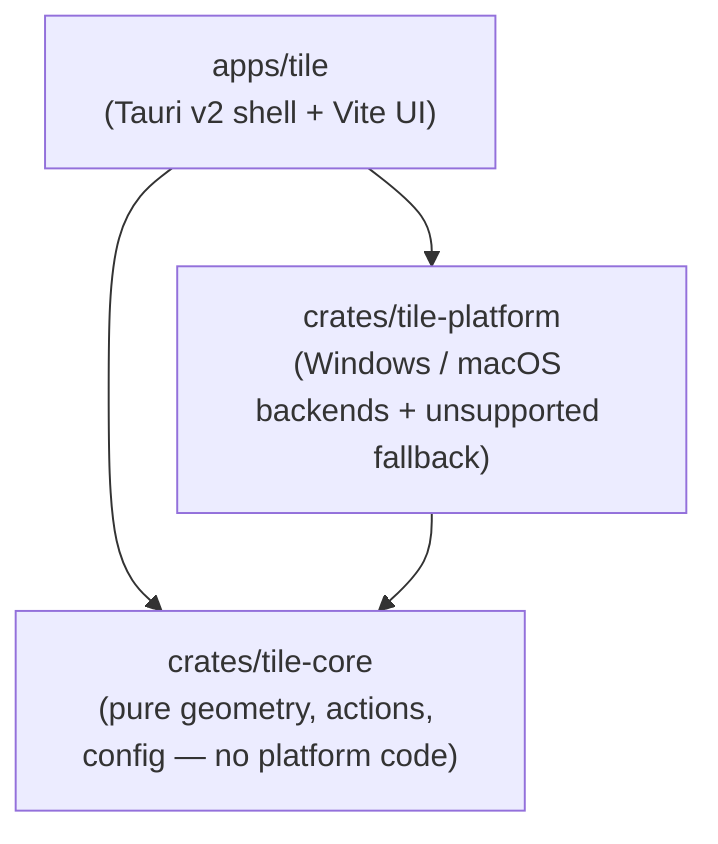

# Tile

**Keyboard-driven window management for Windows and macOS.**

Tile is a cross-platform window management app built from scratch in Rust. Snap
the focused window to halves and thirds of the screen, maximize it, or undo the
last move — all from the arrow keys.

> **Status: early days.** Tile implements 76 window actions — halves, thirds,
> two-thirds, fourths, corner thirds, sixths, ninths, corners, maximize,
> maximize-height, almost-maximize, center, restore, display throws, and
> incremental move, resize and halve/double — but only six ship bound to keys,
> with a settings UI and a tray/menu-bar icon for the rest. Per-app rules and
> drag-snapping are not built yet. This
> README documents only what actually works today.

## Default keyboard shortcuts

Every shortcut is the same on both platforms. Only the modifier you hold
differs:

- **macOS** — `Control` + `Option`
- **Windows** — `Win`

Hold that, then press:

| Key             | Action                                                             |
| --------------- | ------------------------------------------------------------------ |
| `←` `→`         | **Left / right** — half, then two thirds, then a third (see below) |
| `↑`             | Maximize                                                           |
| `↓`             | Restore to the window's previous position                          |
| `Shift`+`←` `→` | **Previous / next display** — same slot, adjacent monitor          |

That is the whole default set — **four arrows, plus Shift to change display.**
The same layout works on both platforms, with the modifier held in the left
hand and the arrows in the right.

The horizontal pair places the window and carries every size, because repeating
an arrow cycles its width:

```text
  ←   ½ → ⅔ → ⅓ → …   anchored left
  →   ½ → ⅔ → ⅓ → …   anchored right
```

The vertical pair is the bigger/undo axis: `↑` maximizes and `↓` restores the
window.

Everything is rebindable, and the rest of the catalogue — the centered column,
the explicitly-sized thirds and two-thirds, the corners, center, maximize-height,
almost-maximize, plus fourths, sixths, ninths, corner thirds, the top/bottom
halves, the incremental move/resize/halve-double families and the
named-display moves — ships unbound, reachable from the tray menu or a binding
of your own.

### Press it again to change the size

Pressing the same shortcut again changes the size. The horizontal arrows and
four corners **cycle through sizes**: half, two thirds, third, then back to
half. Corners cycle their width while keeping their half height.

The sizes are configurable in Settings ▸ Behaviour — ½, ⅔, ¾, ¼ and ⅓. A half,
two thirds and a third are enabled by default; enable ¼ for a four-step cycle,
or turn cycling off so repeats do nothing.

The cycle restarts whenever you run a different action, switch to another
window, or move the window yourself, and `↓` always restores the window
to where it was **before** Tile first touched it, however long you cycled for.

### Reaching a display by name

`Shift`+`←`/`→` steps to the adjacent display and wraps around the ends. When
you would rather name the monitor outright, **First** through **Fourth
Display** are also available, unbound by default.

They count in the same geometric order as the arrows — left to right by
position, then top to bottom — so "second display" means the same monitor every
time, whatever order Windows or macOS happened to enumerate them in, and
whatever the window is doing now. Naming a display that is not plugged in does
nothing.

Both kinds of throw keep the window's slot where they can: a left third stays a
left third on arrival. A window that is not in a recognisable slot keeps its
**relative** place instead, so something filling the right half of a 4K panel
fills the right half of a 1080p one rather than hanging off its edge. That holds
across mixed-DPI desks, because the placement is computed as fractions of each
display's own work area rather than by scaling pixels.

### Nudging, resizing, halving and doubling

Also available, all unbound by default:

| Family | Actions |
| ------ | ------- |
| **Move** | Slide the window one step left, right, up or down, stopping flush against the screen edge |
| **Resize** | Larger / smaller, or just the width or just the height |
| **Halve & Double** | Halve or double the width or height, keeping the named edge |

Resizing anchors to whichever screen edge the window is already flush against,
so a window in the right half grows leftwards instead of being pushed off the
screen; a floating window resizes around its centre. Nothing can be nudged off
the screen, and nothing shrinks below a quarter of the work area.

The step sizes (`sizeStep`, `widthStep` and `moveStep`, each defaulting to 30)
and the floor (`minimumWindowWidth`, `minimumWindowHeight`, defaulting to 0.25)
live in `config.json`; there is no settings UI for them yet.

### Animated snapping

Windows glide to their new frame rather than jumping to it. Each of the four
edges is driven by its own spring, and the edge leading the movement is
stiffer and looser than the one behind it, so the window stretches towards its
destination, overshoots it slightly, and eases back as the trailing edge
catches up — and a shortcut pressed while a window is still in flight redirects
the movement it already has instead of restarting it.

**This is on by default**, including for existing installs, which had no
animation before. Turn it off in Settings ▸ Behaviour ▸ Motion for the instant
snapping Tile used to do; that is also the setting to reach for over a remote
desktop session, or if you would rather have no motion at all.

The timing lives in `config.json` under `animation` and has no settings UI:

```jsonc
"animation": {
  "enabled": true,
  "durationMs": 340, // how long a snap takes, end to end; 40–1000
  "fps": 90          // frames per second; 15–240, capped lower on macOS
}
```

`durationMs` is approximate — a spring approaches its target asymptotically, so
larger moves run slightly over and short nudges finish well under. Try 220 for
something brisker, or 450 for a more languid glide.

### Windows shortcut notes

Tile's keyboard hook replaces Aero Snap for the bound `Win`+Arrow shortcuts.
`Win`+`Shift`+Arrow replaces Windows' move-between-monitors shortcut, while
`Win`+`Ctrl`+`←`/`→` remains available for virtual desktops.

Windows treats `Ctrl`+`Alt` as `AltGr` on many international layouts, so Tile
does not use that modifier by default; doing so could interfere with characters
such as `@`, `€`, `{` and `}`.

<sub>This table is generated from `crates/tile-core/src/config.rs`
(`default_bindings`) — the single source of truth for Tile's defaults.</sub>

## Platform notes

### Windows: the keyboard hook

On Windows, Tile installs a **low-level keyboard hook** (`WH_KEYBOARD_LL`)
rather than registering its shortcuts with the OS. That is what lets it claim
combinations the shell already owns — `Win`+Arrow is Aero Snap, for instance.
This means:

- Tile's shortcuts take precedence over the OS's for the combinations it binds.
  The default `Win`+Arrow set **replaces Aero Snap**.
- The hook **cannot see input directed at windows owned by elevated
  (administrator) processes** unless Tile itself is running as administrator. If
  a shortcut seems to do nothing over an elevated app, that's why.
- Some corporate security software is suspicious of global keyboard hooks and
  may flag or block them.

Replacing the hook with `RegisterHotKey` wherever the OS will grant the
combination is tracked in
[#19](https://github.com/filipmares/tile/issues/19).

### macOS: Accessibility permission

macOS requires you to grant Tile the **Accessibility** permission before it can
move other applications' windows. Grant it under:

**System Settings ▸ Privacy & Security ▸ Accessibility** → enable **Tile**.

You may need to toggle it off and on again after updating the app.

Builds you compile yourself are unsigned, so Gatekeeper blocks their first
launch. Remove the quarantine attribute:

```sh
xattr -dr com.apple.quarantine /Applications/Tile.app
```

…or right-click the app in Finder and choose **Open** the first time. Builds
published on the [Releases](https://github.com/filipmares/tile/releases) page are
signed and notarized and need neither — each release's notes say so explicitly,
and tell you what to do if a particular build was not signed.

## Installation

### From Releases

Grab the latest build from the [Releases](https://github.com/filipmares/tile/releases)
page:

- **macOS:** the universal `.dmg` (runs on both Apple Silicon and Intel). Open
  it and drag **Tile** into Applications. Signed and notarized builds open
  without a Gatekeeper workaround; follow the release notes if a build is
  marked unsigned.
- **Windows:** `Tile_<version>_x64-setup.exe`. It installs for the current user
  only, so there is no administrator prompt, and it pulls in the WebView2
  runtime automatically if the machine lacks it. Unsigned builds make
  SmartScreen warn that the publisher is unknown — choose **More info ▸ Run
  anyway**.

Tile has no main window: after launching, look for its icon in the menu bar
(macOS) or the system tray (Windows).

### From source

See [Build from source](#build-from-source).

## Build from source

### Prerequisites

- **Rust** (stable) — install with [rustup](https://rustup.rs/).
- **Node.js 18+** and npm — for the frontend under `apps/tile/ui`.
- **Windows:** Visual Studio **C++ Build Tools** + **Windows SDK** (provides
  `link.exe`) and the **WebView2** runtime (preinstalled on Windows 11).
- **macOS:** **Xcode Command Line Tools** (`xcode-select --install`).

### Build

```sh
# 1. Frontend dependencies
cd apps/tile/ui && npm ci && cd ../../..

# 2. Build and test the workspace
cargo build --workspace --release
cargo test --workspace
```

### Run the app

```sh
cd apps/tile

# Development: hot-reloading settings UI
./ui/node_modules/.bin/tauri dev

# Release installers. Add `--bundles nsis` on Windows to build only the NSIS
# setup .exe, which is what releases ship; the default also builds an .msi.
./ui/node_modules/.bin/tauri build
```

Installers are written to `target/release/bundle/`. The app has no main
window — look for the icon in the system tray (Windows) or menu bar (macOS),
and choose **Settings…** from its menu.

## Testing

Most of Tile is verifiable without a desktop. `cargo test --workspace` covers
the tiling geometry, the restore history, hotkey parsing, the Windows
`KeyCode`→virtual-key tables and DWM frame arithmetic, and the macOS
coordinate flip — the last of these runs on every platform, not just macOS.

The macOS backend can also be type-checked from Windows or Linux, which is
how it is validated on every pull request:

```sh
rustup target add aarch64-apple-darwin
cargo clippy -p tile-platform --target aarch64-apple-darwin --all-targets -- -D warnings
```

Two things genuinely need a live desktop session, so they ship as examples
rather than tests:

```sh
# Moves a real window through every action and asserts it lands pixel-exact.
# Pass a window handle to target a specific window instead of the focused one.
cargo run --example live_smoke -p tile-platform

# Installs the real keyboard hook, injects Ctrl+Alt+Shift+M, and checks the
# bound action is delivered, repeats, and stops firing once unbound.
cargo run --example live_hotkey -p tile-platform
```

To test the shortcuts end to end, build and start the app, open a window you
do not mind moving, and press <kbd>Win</kbd>+<kbd>←</kbd>. Note
that the keyboard hook cannot see input aimed at windows owned by elevated
processes unless Tile is itself running as administrator.

## Architecture

Tile is split into three crates with a strict dependency direction, so the
interesting logic stays testable and every OS API lives behind a trait:



- **`tile-core`** is pure and platform-independent — geometry math, the window
  actions, hotkey definitions, config load/save, and the decision `Engine`. It
  does no I/O beyond JSON and is **heavily unit-tested**, so all of Tile's
  behaviour can be verified on any host (including Linux CI).
- **`tile-platform`** isolates every OS API behind two traits (window
  manipulation and global hotkeys), with a Windows backend, a macOS backend,
  and an `unsupported` fallback so the crate still compiles on other platforms.
- **`apps/tile`** is a thin [Tauri v2](https://v2.tauri.app/) desktop shell with
  a vanilla TypeScript + Vite frontend — it wires `tile-core`'s engine to
  `tile-platform`'s backends and shows the tray/menu-bar UI.

## Continuous integration

Because the primary development machine is Windows-only, **GitHub Actions is the
only place the macOS build is ever compiled** — so CI is intentionally thorough
and fails loudly. Every push and pull request runs `cargo fmt`, `cargo clippy
--workspace --all-targets -- -D warnings`, and `cargo test` on Windows and
macOS, plus a Linux job for the platform-independent crates. See
[`.github/workflows/ci.yml`](.github/workflows/ci.yml).

## Contributing

Contributions are welcome! Please read [CONTRIBUTING.md](CONTRIBUTING.md) for
the project layout, prerequisites, and the checks CI expects.

## Acknowledgements

Tile is inspired by [Rectangle](https://github.com/rxhanson/Rectangle) by Ryan
Hanson. Tile is an independent Rust implementation.

## License

Tile is released under the [MIT License](LICENSE), © 2026 Filip Mares.
